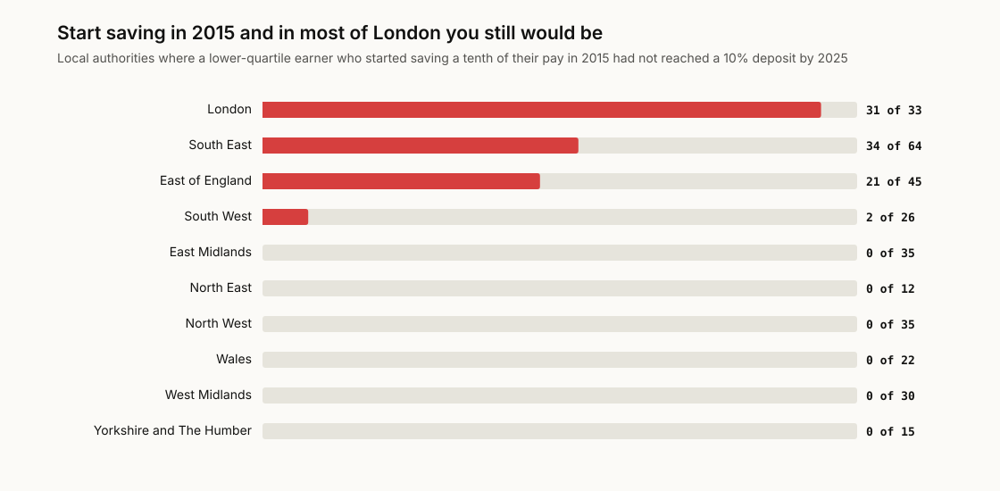
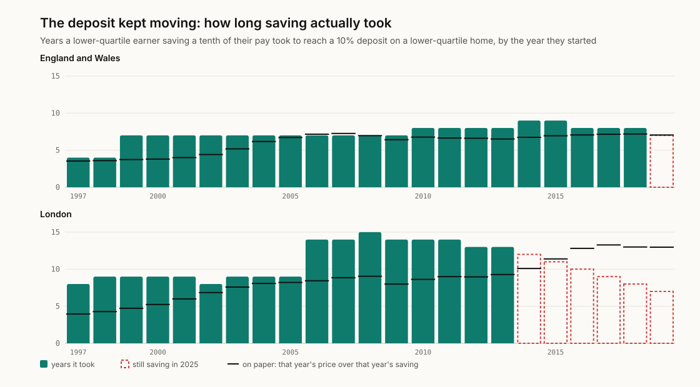
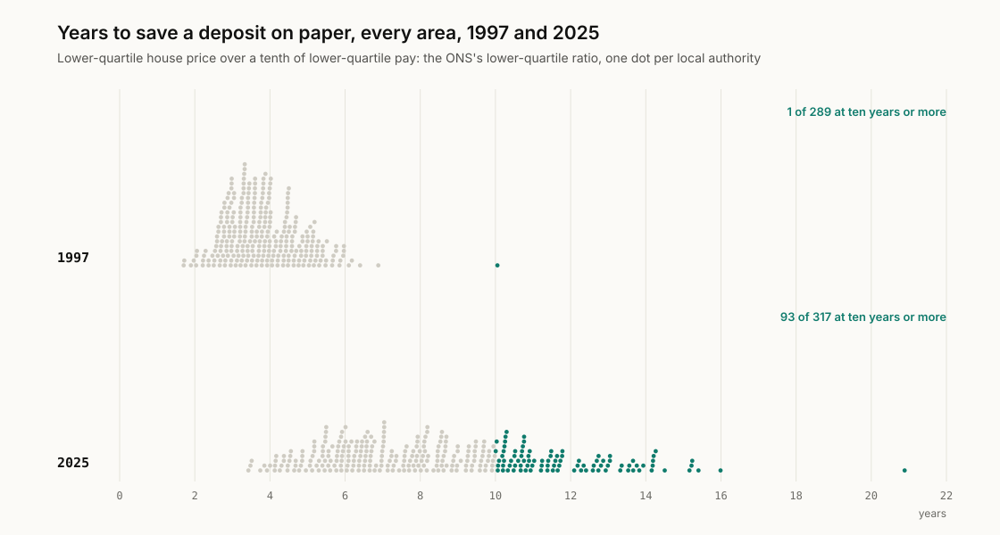

# deposit-gap

How many years of saving a first home's deposit takes in each part of England
and Wales, then and now: on paper, and chasing prices that keep moving while
you save.

**Work out yours:** [finntech3.github.io/deposit-gap](https://finntech3.github.io/deposit-gap/)

**Why I built this.** Deposit advice always assumes the target holds still
while you save towards it. It doesn't. I built a saver who follows the
advice exactly, then timed how long that assumption actually survives.

## The finding

**Someone on lower-quartile pay who started saving for a deposit in 2015 was
still saving in 2025 in 88 of 317 local authorities.** In 31 of London's 33
boroughs, 34 of the South East's 64 districts and 21 of 45 in the East of
England. In the North, the Midlands and Wales, none.

<picture>
  <source media="(prefers-color-scheme: dark)" srcset="docs/figures/regions-dark.svg">
  
</picture>

The saver is the same everywhere: paid the area's lower-quartile full-time
wage, putting a tenth of it aside each year, towards a 10% deposit on the
area's lower-quartile home, with the pot earning what a one-year savings bond
paid that year. Lower quartile because first homes are cheaper than most and
first-time buyers are paid less than most, which is why the ONS publishes a
lower-quartile ratio at all.

For England and Wales as a whole, that saver could buy after 4 years if they
started in 1997, 7 years if they started in 2005, and 9 if they started in
2015. Anyone who started in 2019 was still saving after seven. In London the
1997 starter took 8 years, the 2008 starter 15, and everyone who started from
2014 onwards was still saving in 2025.

<picture>
  <source media="(prefers-color-scheme: dark)" srcset="docs/figures/chase-dark.svg">
  
</picture>

**What I think this means.** "Save for a deposit" has quietly stopped being a
plan for a lower-paid first-time buyer across much of the South, and it still
works almost everywhere else, which is exactly the kind of split a single
national headline number is built to hide. The on-paper sum understates it: in
London the 1997 figure was 4.0 years, and the saver who started that year
needed 8, because prices ran ahead of what they could put aside. The gap
between the sum and the chase is the real cost of a target that moves, and it
is the part every "years to save" headline leaves out.

## Then and now, on paper

With a 10% deposit and a tenth of pay saved, the years it takes on paper are
exactly the ONS's lower-quartile affordability ratio: at a ratio of 7, seven
years. For the median local authority that went from 3.7 years in 1997 to 8.1
in 2025. In 1997 one area in 289 needed ten years or more; in 2025, 93 of 317.

<picture>
  <source media="(prefers-color-scheme: dark)" srcset="docs/figures/areas-dark.svg">
  
</picture>

The quickest in 2025 are County Durham (3.4 years), Burnley and Hyndburn
(3.5); the slowest Tandridge (15.4), Richmond upon Thames (16.0) and
Kensington and Chelsea (20.9). For England and Wales, 2025's 6.8 years is the
lowest since 2014, down from 8.1 at the 2021 peak.

## Verify before you interpret

Every number here is built from the ONS's price and earnings tables, so the
first check is that those tables really do make the ONS's published ratios.

| Check | Result |
|---|---|
| Every published affordability ratio (country, region, county and local authority; median and lower quartile; 1997 to 2025), rebuilt from its price and earnings | 20,021 of 20,021 exact to two decimal places; 337 suppressed by the ONS |
| Twin: each year's prices over the previous year's earnings | 200 of 19,316: fails |

One ratio made me look twice: 119,500 over 20,000 is 5.975, which the ONS
publishes as 5.98. Computers usually round that down, because 5.975 is stored
as a hair under it; the ONS rounds halves up. The rebuild uses exact decimal
arithmetic and rounds as the ONS does.

## The same saver, other ways

| For England and Wales, starting in | 1997 | 2005 | 2010 | 2015 |
|---|---:|---:|---:|---:|
| The saver above | 4 | 7 | 8 | 9 |
| Median pay, median home | 5 | 7 | 8 | 9 |
| Twice the saving (a fifth of pay, or two earners), or half the deposit | 2 | 4 | 4 | 4 |
| Savings earning nothing | 5 | 7 | 8 | 9 |

Only the deposit over the saving matters, so a 5% deposit, saving a fifth of
pay and a couple saving a tenth each are the same case. Interest is worth
about a year. Without it, every start from 1997 to 2004, when a bond paid
between 3.8% and 6.9%, takes a year or two longer; so do the 2009, 2016 and
2017 starts, and the 2018 saver, who got there in 2025 with interest, would
still be saving.

## How it works

- **The data.** The ONS's affordability workbook: median and lower-quartile
  house prices (sales in the year to September, from House Price Statistics
  for Small Areas) and median and lower-quartile full-time earnings of people
  working in each area (April, from the Annual Survey of Hours and Earnings),
  for every local authority from 1997 to 2025, on today's boundaries. And the
  Bank of England's quoted rate on one-year fixed-rate savings bonds, averaged
  over each year.
- **On paper.** The deposit over a year's saving, at one year's prices and pay.
- **The chase.** The saver starts in a given year. Each year they save a tenth
  of that year's local lower-quartile pay, added at the end of the year; the
  pot earns that year's bond rate; they can buy in the first year the pot
  reaches 10% of that year's lower-quartile price. If they have not by 2025,
  they are still saving.

More on each choice in [docs/DESIGN-DECISIONS.md](docs/DESIGN-DECISIONS.md).
Every source, address and checksum is in [docs/SOURCES.md](docs/SOURCES.md).

## What this leaves out

- **Rent.** Saving a tenth of gross pay is an assumption, and in the places
  where the chase fails, rent is the reason a tenth may be out of reach. There
  is no local rent series back to 1997 to build that in.
- **Family money.** Many first-time buyers have help from family. I could not
  find a year-by-year count for recent first-time buyers to use, so this is
  the saver on their own.
- **The rest of the cost.** Stamp duty, fees and moving are not counted, and
  neither is whether a lender would lend the other 90% on that pay.
- **Pay growth over a career.** The saver stays at the area's lower-quartile
  pay; real people usually earn more as they get older, which would shorten
  the chase.
- **Scotland and Northern Ireland.** The ONS publishes these ratios for
  England and Wales only.
- **Where people work.** Earnings are for people working in the area, the
  ONS's headline measure; someone who commutes into London earns London pay
  but may buy elsewhere.

## What I got wrong first

- **I nearly shipped a model that added nothing.** My first version divided a
  10% deposit by a tenth of pay, which is just the ONS's ratio relabelled as
  years. The chase, following a saver while prices move, is what the ratio
  cannot tell you.
- **I trusted binary rounding.** The first rebuild matched 20,020 of 20,021
  ratios; the one miss was a half that the ONS rounds up and floating point
  rounds down. Exact decimal rounding fixed it, and a test pins the case.
- **I committed a test with the wrong answer in it.** I worked out by hand that
  a saver chasing prices rising 3% a year would take 9 years; it is 7, and the
  code was right. The commit went through because a pipe swallowed the test
  failure. Both are fixed, and the arithmetic is now written out in the test.
- **I looked for the family-money numbers and found the wrong ones.** The
  English Housing Survey table on sources of finance covers everyone who ever
  bought their home, not recent first-time buyers, so it could not answer the
  question and is not used.

## Running it

Python 3.11 or later, standard library only.

```sh
python -m pip install pytest
PYTHONPATH=pipeline/src python -m deposit.report    # every number above
python -m pytest pipeline/tests                     # the check, the twin and the saver
python scripts/make_figures.py                      # redraw docs/figures
PYTHONPATH=pipeline/src python -m deposit.build     # the app's data
```

The app, in `web/`, needs Node 22:

```sh
cd web
npm ci
npm test
npm run dev
```

## License

MIT for the code. ONS data are used under the Open Government Licence v3.0;
the Bank of England's statistics are reused under its terms.
